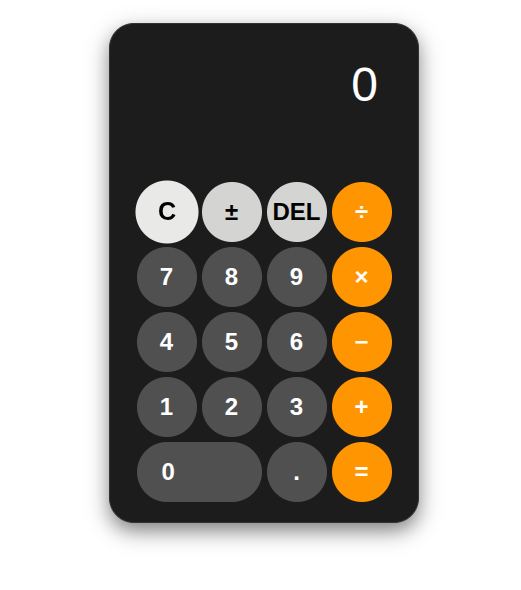

# 🧮 Web Calculator

A simple, elegant, and fully functional web calculator built using **HTML**, **CSS**, and **JavaScript**.

## 🚀 Features

- Basic arithmetic operations: `+`, `−`, `×`, `÷`
- Keyboard support for faster input
- Decimal and sign toggle support
- Clear (C), Delete (DEL), and Equals (=) buttons
- Responsive design with smooth button animation
- No use of `eval()` for safe and clean evaluation

## 📸 Screenshot

## 🧠 Keyboard Shortcuts

| Key       | Function           |
|-----------|--------------------|
| 0-9       | Number input       |
| `+`, `-`, `*`, `/` | Operators  |
| `Enter` or `=` | Calculate      |
| `Backspace`     | Delete last digit |
| `Escape` or `c` | Clear all     |
| `.`             | Add decimal   |

